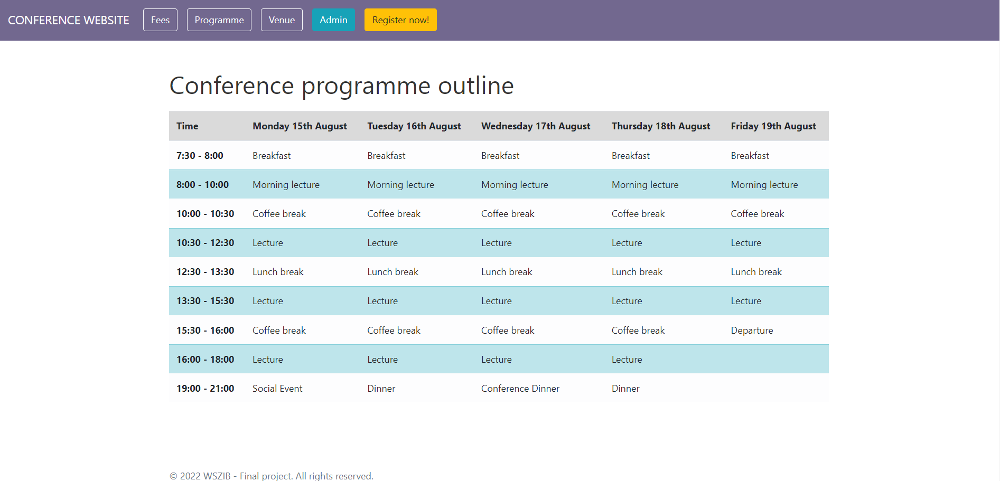

## Projekt końcowy na studia podyplomowe *Java web developer*
#### Autor: Anna Kluza

#### Nazwa projektu: *Strona konferencyjna*
#### Założenia ogólne:
- Aplikacja umożliwia rejestrację uczestników konferencji
- Uczestnik ("Attendee") wprowadza swoje dane (imię, nazwisko, afiliację, miasto, państwo, email), które zapisywane są w bazie danych
- Automatycznie generowane jest ID uczestnika oraz data rejestracji
- Admin może przeglądać listę zarejestrowanych osób, edytować dane i usuwać uczestników (dodatkowo zapisywana jest data aktualizacji danych danego uczestnika)

Aplikacja dostępna jest na serwerze Heroku pod adresem:

### Strona główna

### Podstrona zawierająca informacje o opłatach

### Podstrona zawierająca wstępny program

### Podstrona z lokalizacją konferencji (wraz z mapką)

### Podstrona umożliwiająca rejestrację uczestników

Jeśli uczestnik wprowadził liczbę znaków nie zawierającą się w przedziale 3-30, poproszony zostanie o naniesienie poprawek.

### Powiadomienie o rejestracji z powodzeniem

Jeśli uczestnik zarejestrował się z powodzeniem, zostanie przekierowany na informującą o tym stronę.

### Podstrona administratora

Admin widzi informację o wszystkich zarejestrowanych uczestnikach. Admin może edytować dane uczestników i usuwać uczestników.
Po edycji danych/usunięciu uczestnika admin przekierowywany jest z powrotem na stroną admina.

